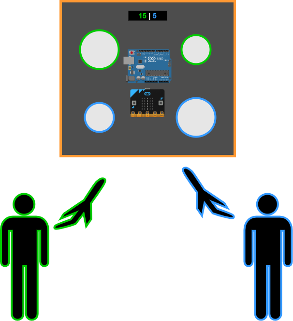
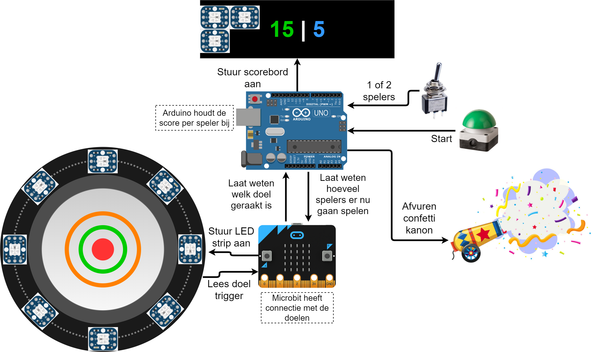
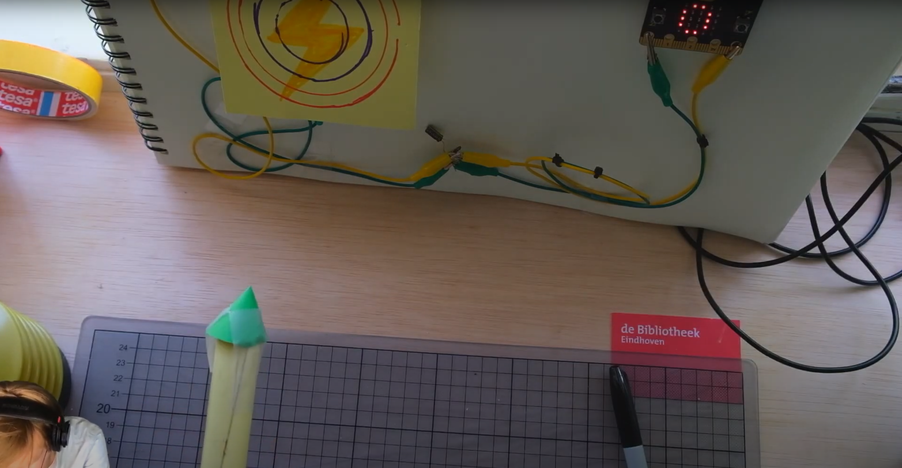

# RocketLaunch

    

Een spelletje spelen is altijd leuk. Dingen snel door de lucht laten vliegen is nog leuker. Waarom dit dan niet combineren?

RocketLaunch is een spel die je met 1 of 2 spelers kan spelen. Het doel is simpel. Vouw je eigen raket, schiet dit op een doel en scoor als eerste de benodigde punten om te winnen.

# Hoe werkt het

    

De twee belangrijkste onderdelen in dit systeem zijn:
- De [Arduino](https://www.arduino.cc/)
- De [Micro:Bit](https://microbit.org/)

Bijde onderdelen zijn **microprocessoren**. Microprocessoren zijn een hele kleine en 'simpele' versie van een standaard computer. 

Microprocessoren zitten in dingen zoals:
- Je mobiel
- Een auto
- Een stoplicht
- Je oven
- Een monitor
- In smart-home apparaten zoals Philips Hue lampen en de thermostaat
- **En nog veel meer!**

Door **code** te schrijven voor de Arduino en Micro:Bit kunnen ze geprogrammeerd worden om alles te doen wat je maar wilt. 

In het geval van RocketLaunch willen we dat de Micro:Bit de LEDs op de doelen een bepaalde kleur geeft en dat de Micro:Bit leest of een doel is geraarkt en dit doorgeeft aan de Arduino. De Arduino heeft andere taken. In het systeem moet de Arduino de punten van de spelers bijhouden door de berichten van de Micro:Bit te lezen. De Arduino moet de punten daarna op het scoreboard laten zien.

Hoe deze code er uit ziet kan je zien in de bestanden op deze pagina. Om meer te leren over hoe deze code precies werkt kan je naar de [wiki](https://gitlab.com/MakersClub040/rocketlaunch/-/wikis/home) gaan.

# Bouw je eigen mini versie
Wil je dit nou ook thuis spelen? Dat kan! Klik op de afbeelding om naar de video te gaan.

<a href="https://youtu.be/fMZb9fl21DU">
    

        
    

</a>

<!--- - [Google drive](https://drive.google.com/drive/folders/1y4lLs7OTMrHxcFS39k9iCg1lIVsyEbma?usp=sharing) --->

